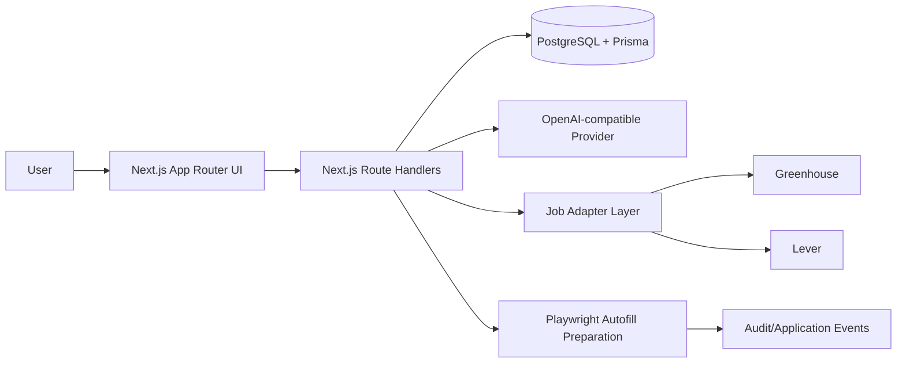

# AutoApply AI Architecture

## Core modules
1. Auth
2. Profile ingestion + resume parser
3. Job ingestion adapters
4. Fit scoring engine
5. AI generation service
6. Automation preparation engine
7. Applications tracker
8. Audit logs
